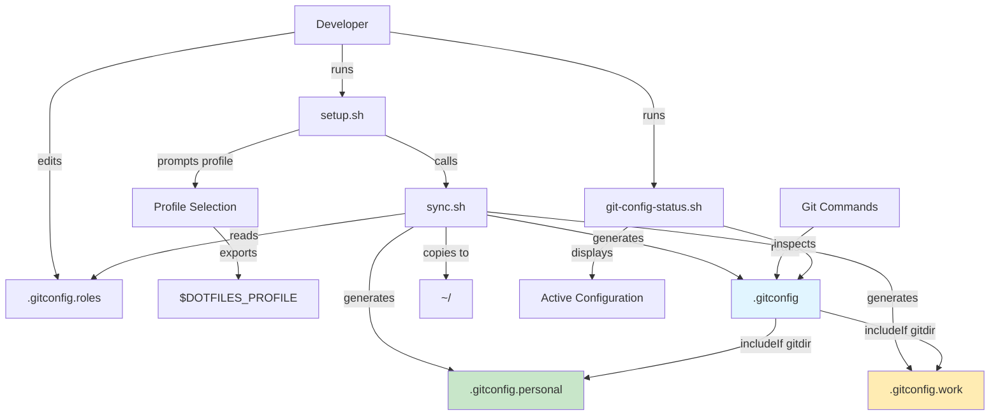
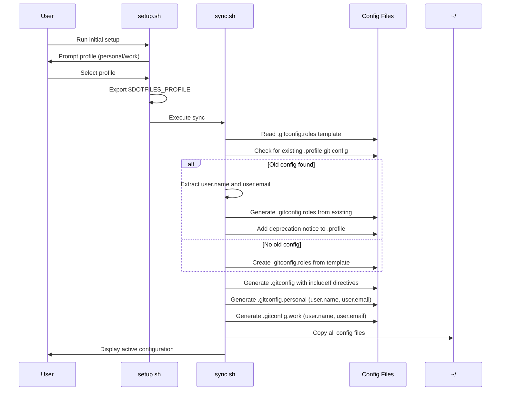
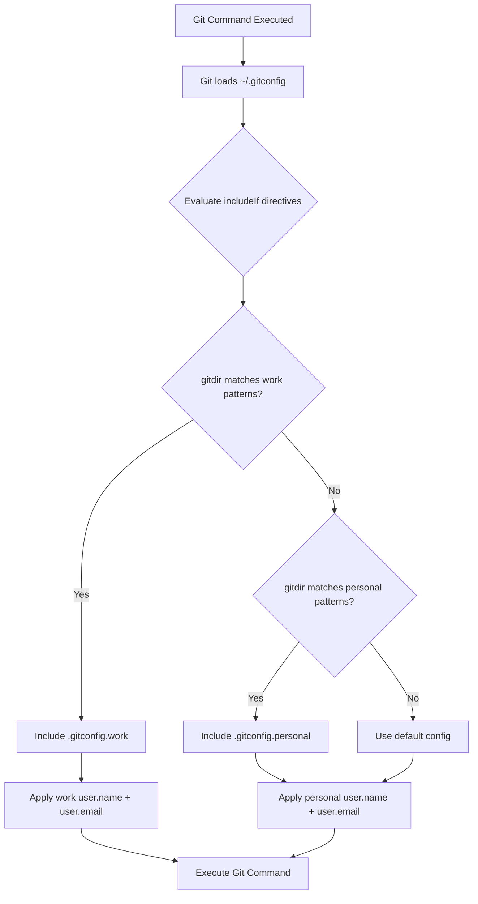
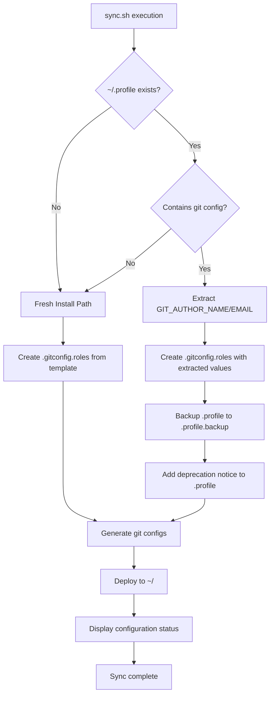

# Design Document

## Overview

The git-config-role feature automates Git user configuration (name and email) based on role context detection (personal vs work). It replaces the current manual global configuration approach with Git's native conditional includes feature, enabling per-repository automatic role detection based on directory patterns.

**Purpose**: This feature eliminates manual Git configuration and ensures commits always use the correct author information based on repository location.

**Users**: Developers using the dotfiles repository who work on both personal and work projects from the same machine will automatically get role-appropriate Git configurations.

**Impact**: Changes the current global Git config approach (set once at shell startup) to a per-repository conditional config system that adapts to directory context.

### Goals

- Automatic role detection based on repository directory path
- Per-repository Git configuration without manual intervention
- Backward-compatible migration from existing `.profile` approach
- Clear validation and debugging tools for configuration verification

### Non-Goals

- Automatic SSH key switching (separate concern)
- GPG signing key management (handled separately if needed)
- Git credential management (separate from user identity)
- Support for more than two roles (personal/work) in initial version

## Architecture

### Existing Architecture Analysis

**Current Implementation**:

- `scripts/setup.sh` prompts user to select profile (personal/work) and exports `$DOTFILES_PROFILE`
- `src/.profile` contains role detection logic checking environment variables (`$DOTFILES_PROFILE`, `$WORK_PROFILE`), hostname patterns, and `$PWD`
- `.profile` sets global Git config using `git config --global user.name` and `user.email`
- `scripts/sync.sh` copies dotfiles from `src/` to `~/` with backup

**Limitations**:

- Global configuration doesn't adapt to per-repository context
- Detection logic runs at shell startup, not when entering repositories
- No per-directory customization
- Manual profile selection required during setup

**Integration Points to Preserve**:

- `scripts/setup.sh` profile selection mechanism
- `scripts/sync.sh` dotfile deployment process
- Backup system in `scripts/backup.sh`
- Existing `.gitconfig` aliases and settings

### Architecture Pattern & Boundary Map



**Architecture Integration**:

- **Selected Pattern**: Configuration-based conditional includes using Git native features
- **Domain Boundaries**:
  - Setup/configuration domain: `setup.sh`, `sync.sh`, `.gitconfig.roles`
  - Runtime Git domain: `.gitconfig`, `.gitconfig.personal`, `.gitconfig.work`
  - Validation domain: `git-config-status.sh`
- **Existing Patterns Preserved**:
  - Profile selection via `$DOTFILES_PROFILE` in `setup.sh`
  - Dotfile sync pattern in `sync.sh`
  - Backup-first approach from `backup.sh`
- **New Components Rationale**:
  - `.gitconfig.roles`: Central configuration for role identities and directory patterns
  - `.gitconfig.{personal,work}`: Git-native role-specific configs
  - `git-config-status.sh`: Validation and debugging tool
- **Steering Compliance**: Maintains modularity (separate script per concern), safety (backup first), and automation-first principles

### Technology Stack

| Layer         | Choice / Version       | Role in Feature                              | Notes                                                |
| ------------- | ---------------------- | -------------------------------------------- | ---------------------------------------------------- |
| Git           | Git 2.13+              | Conditional includes engine                  | Native `includeIf` support; macOS ships with 2.30+   |
| Shell         | Zsh                    | Configuration generation, validation scripts | Existing dotfiles standard                           |
| Configuration | Shell-sourceable files | Store role identities and patterns           | Aligns with existing `.profile`, `.aliases` patterns |

## System Flows

### Setup and Configuration Flow



### Runtime Role Detection Flow



**Flow Design Decisions**:

- Git's `includeIf` evaluation is automatic and transparent to user
- Multiple patterns supported with first-match-wins semantics
- Default fallback to personal config ensures Git always configured
- No runtime overhead (native Git feature)

## Requirements Traceability

| Requirement                  | Summary                  | Components                                                        | Interfaces                             | Flows             |
| ---------------------------- | ------------------------ | ----------------------------------------------------------------- | -------------------------------------- | ----------------- |
| 1.1, 1.2, 1.3, 1.4, 1.5, 1.6 | Automatic role detection | `.gitconfig` with `includeIf`, `.gitconfig.roles`                 | Shell config, Git conditional includes | Runtime detection |
| 2.1, 2.2, 2.3, 2.4, 2.5      | Role-based configuration | `.gitconfig.personal`, `.gitconfig.work`                          | Git config format                      | Runtime detection |
| 3.1, 3.2, 3.3, 3.4, 3.5      | Configuration management | `.gitconfig.roles`, `sync.sh`                                     | Shell-sourceable config                | Setup flow        |
| 4.1, 4.2, 4.3, 4.4, 4.5      | Setup integration        | `sync.sh` migration logic                                         | Setup script integration               | Setup flow        |
| 5.1, 5.2, 5.3, 5.4, 5.5      | Directory-based config   | `.gitconfig` `includeIf` patterns                                 | Git conditional includes               | Runtime detection |
| 6.1, 6.2, 6.3, 6.4, 6.5      | Validation and feedback  | `git-config-status.sh`                                            | Command-line interface                 | Status check      |
| 7.1, 7.2, 7.3, 7.4, 7.5      | Error handling           | Fallback logic in `sync.sh`, validation in `git-config-status.sh` | Error messages, defaults               | Setup and runtime |

## Components and Interfaces

| Component            | Domain/Layer  | Intent                                       | Req Coverage              | Key Dependencies (P0/P1)                       | Contracts   |
| -------------------- | ------------- | -------------------------------------------- | ------------------------- | ---------------------------------------------- | ----------- |
| .gitconfig.roles     | Configuration | Store role identities and directory patterns | 3.1-3.5                   | None                                           | Config File |
| .gitconfig           | Configuration | Main Git config with conditional includes    | 1.1-1.6, 2.1-2.5, 5.1-5.5 | .gitconfig.personal (P0), .gitconfig.work (P0) | Config File |
| .gitconfig.personal  | Configuration | Personal role Git identity                   | 2.1, 2.5                  | None                                           | Config File |
| .gitconfig.work      | Configuration | Work role Git identity                       | 2.2, 2.5                  | None                                           | Config File |
| sync.sh (enhanced)   | Setup         | Generate and deploy Git config files         | 3.1-3.5, 4.1-4.5, 7.1-7.5 | .gitconfig.roles (P0), existing .profile (P1)  | Script      |
| git-config-status.sh | Validation    | Display active configuration and debug       | 6.1-6.5                   | Git (P0), .gitconfig.\* files (P0)             | Script      |

### Configuration Layer

#### .gitconfig.roles

| Field             | Detail                                                                            |
| ----------------- | --------------------------------------------------------------------------------- |
| Intent            | Central configuration file storing role identities and directory pattern mappings |
| Requirements      | 3.1, 3.2, 3.3, 3.4, 3.5                                                           |
| Owner / Reviewers | Setup team                                                                        |

**Responsibilities & Constraints**

- Store personal and work Git identities (name, email)
- Define directory patterns for automatic work role detection
- Provide human-editable format with clear examples
- Must be shell-sourceable for use in sync.sh

**Dependencies**

- Outbound: None (source file)
- Inbound: sync.sh reads during config generation (Criticality: P0)

**Contracts**: Config File [x]

##### Config File Format

```bash
# .gitconfig.roles - Role-based Git configuration
# Edit this file to customize your Git identities and directory patterns

# Personal Identity
GIT_PERSONAL_NAME="Garrett Jones"
GIT_PERSONAL_EMAIL="garrettjones@me.com"

# Work Identity
GIT_WORK_NAME="Garrett Jones"
GIT_WORK_EMAIL="garrettj@slalom.com"

# Work Directory Patterns (one per line, supports glob patterns)
# Repositories under these paths will use work identity
# Use ** for recursive matching: ~/work/** matches all repos under ~/work/
GIT_WORK_PATTERNS=(
  "~/work/**"
  "~/clients/**"
  "~/code/work/**"
)

# Default role when no patterns match (personal|work)
GIT_DEFAULT_ROLE="personal"
```

**Implementation Notes**

- **Integration**: Sourced by sync.sh during config file generation
- **Validation**: sync.sh validates required variables exist before generation
- **Risks**: Manual edits could introduce syntax errors; sync.sh includes basic validation

#### .gitconfig (Enhanced)

| Field        | Detail                                                                             |
| ------------ | ---------------------------------------------------------------------------------- |
| Intent       | Main Git configuration with conditional includes for role-based identity switching |
| Requirements | 1.1-1.6, 2.1-2.5, 5.1-5.5                                                          |

**Responsibilities & Constraints**

- Preserve existing Git aliases and settings
- Include role-specific configs via `includeIf` directives
- Ensure deterministic pattern matching order
- Must remain valid Git config format

**Dependencies**

- Outbound: `.gitconfig.personal` (P0), `.gitconfig.work` (P0)
- Inbound: Git runtime (P0)

**Contracts**: Config File [x]

##### Config File Structure

```ini
# ~/.gitconfig - Main Git configuration
# WARNING: This file is generated by sync.sh - manual edits may be overwritten
# To customize your Git identities, edit ~/.gitconfig.roles and run sync.sh

[alias]
  # Existing aliases preserved from src/.gitconfig
  adda = !git add -A && git status
  tags = tag -l
  branches = branch -a
  # ... other aliases ...

[color]
  ui = always

[core]
  excludesfile = ~/.gitignore
  attributesfile = ~/.gitattributes

# ... other existing settings ...

# Role-based configuration (conditional includes)
# Work directory patterns evaluated first
[includeIf "gitdir:~/work/**"]
  path = ~/.gitconfig.work

[includeIf "gitdir:~/clients/**"]
  path = ~/.gitconfig.work

[includeIf "gitdir:~/code/work/**"]
  path = ~/.gitconfig.work

# Default to personal configuration
[include]
  path = ~/.gitconfig.personal
```

**Implementation Notes**

- **Integration**: Generated by sync.sh from `.gitconfig.roles` patterns and base `.gitconfig` template
- **Validation**: Patterns must use absolute paths or `~/` notation; validated during generation
- **Risks**: Overlapping patterns - mitigated by explicit ordering (work patterns first, then default personal)

#### .gitconfig.personal

| Field        | Detail                                   |
| ------------ | ---------------------------------------- |
| Intent       | Personal role Git identity configuration |
| Requirements | 2.1, 2.5                                 |

**Responsibilities & Constraints**

- Set `user.name` and `user.email` for personal repositories
- Included by default when no work patterns match

**Contracts**: Config File [x]

##### Config File Format

```ini
# ~/.gitconfig.personal - Personal Git identity
[user]
  name = Garrett Jones
  email = garrettjones@me.com
```

**Implementation Notes**

- **Integration**: Generated by sync.sh from `.gitconfig.roles` variables
- **Validation**: Ensures name and email are non-empty during generation

#### .gitconfig.work

| Field        | Detail                               |
| ------------ | ------------------------------------ |
| Intent       | Work role Git identity configuration |
| Requirements | 2.2, 2.5                             |

**Responsibilities & Constraints**

- Set `user.name` and `user.email` for work repositories
- Included when repository path matches work patterns

**Contracts**: Config File [x]

##### Config File Format

```ini
# ~/.gitconfig.work - Work Git identity
[user]
  name = Garrett Jones
  email = garrettj@slalom.com
```

**Implementation Notes**

- **Integration**: Generated by sync.sh from `.gitconfig.roles` variables
- **Validation**: Ensures name and email are non-empty during generation

### Setup Layer

#### sync.sh (Enhanced)

| Field        | Detail                                                                         |
| ------------ | ------------------------------------------------------------------------------ |
| Intent       | Generate Git config files from role configuration and deploy to home directory |
| Requirements | 3.1-3.5, 4.1-4.5, 7.1-7.5                                                      |

**Responsibilities & Constraints**

- Read `.gitconfig.roles` configuration
- Generate `.gitconfig` with conditional includes
- Generate `.gitconfig.personal` and `.gitconfig.work`
- Migrate existing `.profile` Git config if present
- Preserve existing `.gitconfig` aliases and settings
- Validate all generated configs before deployment
- Maintain backup-first approach

**Dependencies**

- Inbound: Called by `setup.sh` (P0)
- Outbound: Reads `src/.gitconfig.roles` (P0), reads existing `~/.profile` (P1), writes to `~/` (P0)
- External: Git binary for version check (P0)

**Contracts**: Script [x]

##### Script Interface

```bash
#!/usr/bin/env zsh
# scripts/sync.sh - Enhanced with git-config-role generation

# Main execution flow:
# 1. Backup existing dotfiles (existing functionality)
# 2. Check Git version >= 2.13 for includeIf support
# 3. Read or create .gitconfig.roles
# 4. Migrate legacy .profile git config if present
# 5. Generate .gitconfig with includeIf directives
# 6. Generate .gitconfig.personal and .gitconfig.work
# 7. Sync all dotfiles to ~/
# 8. Display active Git configuration

# Key functions to add:
check_git_version()       # Verify Git >= 2.13
migrate_legacy_config()   # Extract config from .profile
generate_roles_config()   # Create .gitconfig.roles if missing
generate_git_configs()    # Create .gitconfig, .personal, .work
validate_git_config()     # Test generated configs are valid
display_git_status()      # Show active configuration
```

**Preconditions:**

- Zsh shell available
- Git installed (version 2.13+)
- Write permissions to home directory

**Postconditions:**

- All Git config files deployed to `~/`
- Backup created of previous configs
- Active Git configuration displayed to user
- Migration notices logged if legacy config detected

**Invariants:**

- Git user.name and user.email always configured (never left empty)
- Original `.gitconfig` aliases preserved
- Backup created before any overwrites

**Implementation Notes**

- **Integration**: Called by `setup.sh` as final step; can be run standalone for updates
- **Validation**: Validates `.gitconfig.roles` syntax, checks Git version, tests generated configs with `git config --list`
- **Risks**:
  - Git version < 2.13 - fallback to global config with warning message
  - Invalid `.gitconfig.roles` syntax - display error with line number, use defaults
  - Legacy `.profile` parsing failure - log warning, prompt user for manual config

### Validation Layer

#### git-config-status.sh

| Field        | Detail                                                     |
| ------------ | ---------------------------------------------------------- |
| Intent       | Display current Git configuration and debug role detection |
| Requirements | 6.1, 6.2, 6.3, 6.4, 6.5                                    |

**Responsibilities & Constraints**

- Detect currently active Git user.name and user.email
- Determine which role configuration is active
- Show which pattern matched (if in repository context)
- Display directory patterns from `.gitconfig.roles`
- Provide actionable remediation steps for issues
- Support dry-run mode for testing patterns

**Dependencies**

- Outbound: Git binary (P0), reads `~/.gitconfig*` files (P0), reads `~/.gitconfig.roles` (P0)
- Inbound: Called by user manually or by `setup.sh` (P1)

**Contracts**: Script [x]

##### Script Interface

```bash
#!/usr/bin/env zsh
# scripts/git-config-status.sh - Git configuration validation and status

# Usage:
#   ./git-config-status.sh              # Show current status
#   ./git-config-status.sh --dry-run    # Test pattern matching without executing

# Functions:
show_current_config()     # Display active user.name and user.email
detect_active_role()      # Determine which role (personal/work) is active
show_matching_pattern()   # Show which includeIf pattern matched
show_all_patterns()       # Display configured work directory patterns
validate_config()         # Check for common issues (missing files, invalid patterns)
suggest_fixes()           # Provide remediation steps for detected issues

# Exit codes:
# 0 - Configuration valid and working
# 1 - Configuration issues detected
# 2 - Invalid usage or missing dependencies
```

**Preconditions:**

- Git installed
- At least one `.gitconfig` file exists
- Zsh shell available

**Postconditions:**

- Configuration status displayed
- Issues identified and logged
- Remediation suggestions provided

**Output Format:**

```
Git Configuration Status
========================

Active Configuration:
  Name:  Garrett Jones
  Email: garrettj@slalom.com
  Role:  work

Detection Method: Directory pattern match
Matched Pattern:  ~/work/**
Current Directory: /Users/garrett/work/project-name

Configured Work Patterns:
  - ~/work/**
  - ~/clients/**
  - ~/code/work/**

Default Role: personal

Status: ✓ Configuration is valid and active
```

**Implementation Notes**

- **Integration**: Run automatically at end of `setup.sh`; documented in README for manual use
- **Validation**: Checks file existence, Git command availability, pattern syntax
- **Risks**: May not detect complex conditional include logic; documents limitations in output

## Data Models

### Configuration Data

**Logical Model:**

```
RoleConfiguration
├─ personal: RoleIdentity
│  ├─ name: string
│  └─ email: string
├─ work: RoleIdentity
│  ├─ name: string
│  └─ email: string
├─ workPatterns: string[]
└─ defaultRole: enum("personal", "work")
```

**Storage Format:** Shell-sourceable `.gitconfig.roles` file

**Consistency & Integrity:**

- All identity fields (name, email) are required and validated as non-empty
- Work patterns must be valid glob patterns with absolute or `~/` paths
- Default role must be "personal" or "work"
- Validated at sync time before config generation

## Error Handling

### Error Strategy

**User Errors:**

- Invalid `.gitconfig.roles` syntax → Display line number and syntax example, use defaults
- Invalid directory patterns → Log warning, skip invalid pattern, continue with valid patterns
- Missing configuration file → Create from template with placeholder values, prompt user to edit

**System Errors:**

- Git version < 2.13 → Warn about missing `includeIf` support, fall back to global config
- Git binary not found → Error during sync, provide installation instructions
- File write permission denied → Log error with specific path, suggest permission fix

**Business Logic Errors:**

- No patterns match current directory → Fall back to personal config (documented behavior)
- Overlapping work patterns → Use first match, document pattern order importance
- Empty name or email → Reject during sync, require valid values

**Error Examples:**

```bash
# Invalid syntax in .gitconfig.roles
ERROR: Invalid syntax in .gitconfig.roles at line 15
Expected: GIT_WORK_PATTERNS=( ... )
Found:    GIT_WORK_PATTERNS[ ...
Fix: Edit ~/.gitconfig.roles and correct the syntax

# Git version too old
WARNING: Git version 2.10 detected, but 2.13+ required for conditional includes
Falling back to global configuration. Consider upgrading Git.

# Missing configuration
WARNING: ~/.gitconfig.roles not found
Creating from template at ~/.gitconfig.roles
Please edit this file with your personal and work email addresses
Then run: ./scripts/sync.sh
```

### Monitoring

- Log all sync operations to `~/.dotfiles_sync.log`
- Log migration actions from legacy `.profile`
- Display configuration summary after sync completion
- `git-config-status.sh` provides on-demand validation

## Testing Strategy

### Unit Tests

- Shell script function testing using `shunit2` or manual verification:
  - `check_git_version()` - Correctly identifies Git versions >= 2.13
  - `migrate_legacy_config()` - Extracts name/email from `.profile` correctly
  - `generate_git_configs()` - Produces valid Git config syntax
  - `validate_git_config()` - Detects syntax errors in generated configs

### Integration Tests

- End-to-end sync flow:
  - Fresh install: `setup.sh` → `.gitconfig.roles` created → configs generated → status displayed
  - Migration: Existing `.profile` git config → extracted to `.gitconfig.roles` → old config preserved with notice
  - Config update: Edit `.gitconfig.roles` → run `sync.sh` → changes reflected in `git config --list`
- Git behavior verification:
  - Create test repo under work pattern path → verify work email used
  - Create test repo under personal path → verify personal email used
  - Test `git commit` author resolution in both contexts

### Manual E2E Tests

- Install on clean macOS system with default Git version
- Install with existing dotfiles and `.profile` git config (migration scenario)
- Test `git-config-status.sh` output in various directory contexts
- Verify `git config --list` shows correct includes and user.email
- Edit `.gitconfig.roles` patterns, re-sync, verify pattern matching

### Validation Scripts

- `git-config-status.sh` serves as built-in validation tool
- Test patterns: `git config --show-origin user.email` to verify include source
- Syntax validation: `git config --list` exit code 0 confirms valid config

## Migration Strategy



**Migration Phases:**

1. **Detection Phase** (sync.sh startup)

   - Check for `~/.profile` existence
   - Grep for `GIT_AUTHOR_NAME` and `GIT_AUTHOR_EMAIL` patterns
   - Determine fresh install vs migration scenario

2. **Extraction Phase** (if migration needed)

   - Parse name from `GIT_AUTHOR_NAME="..."` line
   - Parse personal email from `GIT_AUTHOR_EMAIL="..."` (personal branch)
   - Parse work email from `GIT_AUTHOR_EMAIL="..."` (work branch)
   - Extract work detection logic patterns if present

3. **Generation Phase**

   - Create `.gitconfig.roles` with extracted or default values
   - Generate `.gitconfig` with `includeIf` directives
   - Generate `.gitconfig.personal` and `.gitconfig.work`

4. **Preservation Phase** (migration only)

   - Copy `~/.profile` to `~/.profile.backup` with timestamp
   - Prepend deprecation notice to `.profile`:
     ```bash
     # NOTICE: Git configuration has been migrated to ~/.gitconfig.roles
     # The git config logic below is deprecated and no longer used
     # Edit ~/.gitconfig.roles to update your Git identities
     # Original config preserved below for reference
     ```

5. **Validation Phase**
   - Run `git config --list` to verify generated configs are valid
   - Test pattern matching with `git-config-status.sh`
   - Display active configuration to user

**Rollback Triggers:**

- Invalid Git config syntax generated → abort sync, restore from backup
- Git version check fails → warn user, ask to proceed with fallback or abort
- User interrupts sync (Ctrl+C) → cleanup partial files, restore backups

**Validation Checkpoints:**

- After extraction: Verify name and email values are non-empty
- After generation: Verify all `.gitconfig*` files have valid syntax
- After deployment: Verify `git config user.email` returns expected value
- End of sync: Run `git-config-status.sh` and display results
