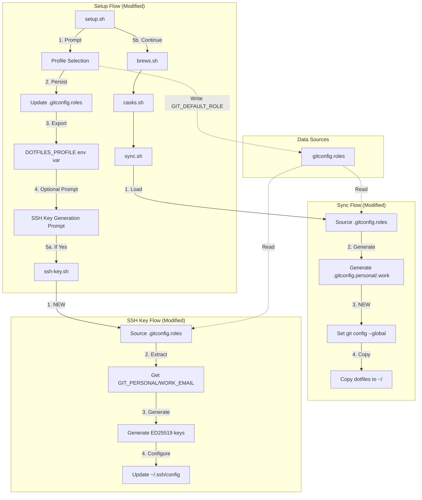
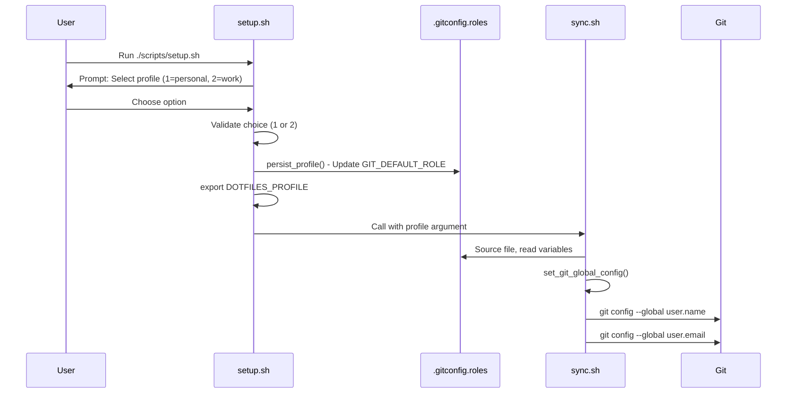
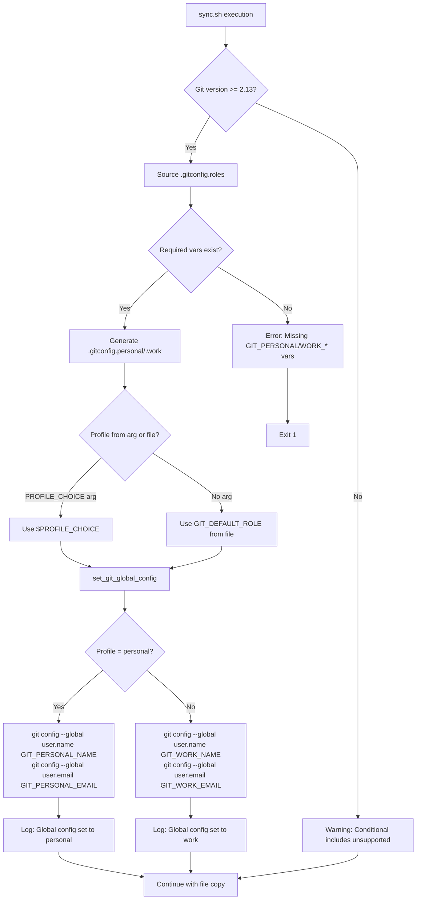
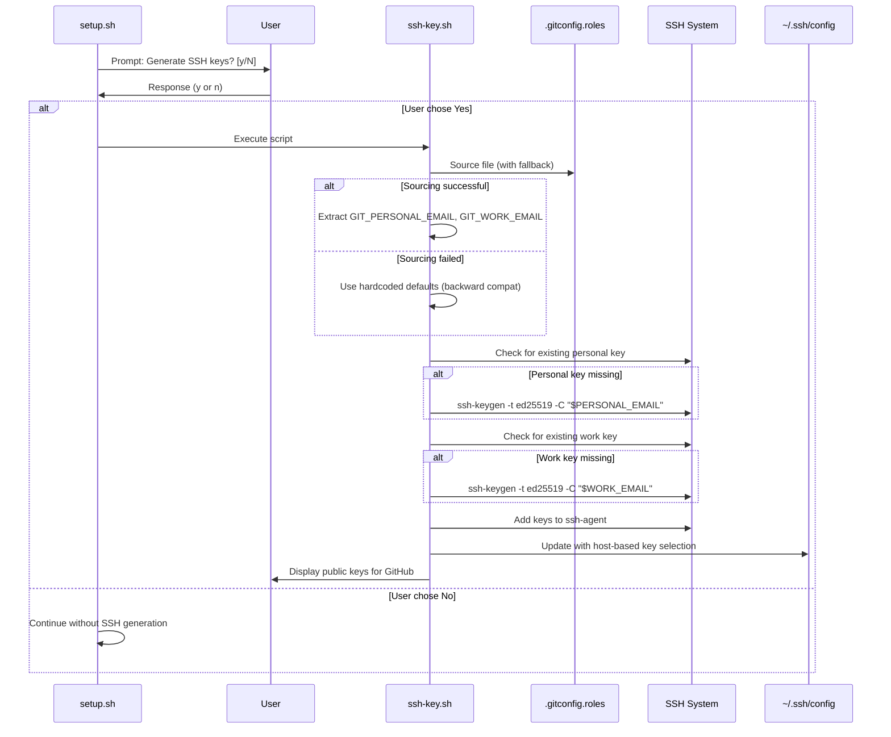

# Design Document: Profile Configuration Management

## Overview

This feature enhances the existing dotfiles profile management system to ensure complete end-to-end consistency of profile-specific settings across Git configuration, SSH keys, and all profile-dependent components. The implementation extends three existing scripts (setup.sh, sync.sh, ssh-key.sh) to add missing functionality identified in the gap analysis: direct Git global config execution, early profile persistence, and integrated SSH key generation with profile-aware email sourcing.

**Users**: Developers working on macOS who maintain separate personal and work development environments.

**Impact**: Changes the current profile management flow by adding direct `git config --global` execution during setup and sync operations, persisting profile selection immediately after prompt, and optionally integrating SSH key generation with automatic email sourcing from `.gitconfig.roles`.

### Goals

- Execute `git config --global user.name/email` based on selected profile during setup and sync
- Persist profile selection in `.gitconfig.roles` immediately after user prompt in setup.sh
- Integrate SSH key generation into setup flow with profile-aware email sourcing
- Maintain single source of truth (`.gitconfig.roles`) for all profile-specific email addresses
- Ensure backward compatibility with existing installations and standalone script execution

### Non-Goals

- Multiple profile support beyond personal/work (future consideration)
- Dynamic profile switching without re-running sync
- Cross-platform support (remains macOS-only)
- Migration from other dotfile management systems

## Architecture

### Existing Architecture Analysis

The dotfiles system uses a shell script orchestration pattern with the following characteristics:

**Current Profile Flow**:

```
setup.sh → Profile prompt (personal|work) → export DOTFILES_PROFILE
  ↓
brews.sh (reads $DOTFILES_PROFILE for conditional package installation)
  ↓
casks.sh (reads $DOTFILES_PROFILE for conditional app installation)
  ↓
sync.sh "$DOTFILES_PROFILE" (updates GIT_DEFAULT_ROLE, generates Git configs)
```

**Current Git Configuration System**:

- `.gitconfig.roles` serves as source of truth for identity variables
- sync.sh generates `.gitconfig.personal` and `.gitconfig.work` from `.gitconfig.roles`
- Main `.gitconfig` uses conditional `includeIf "gitdir:..."` directives for auto-switching
- **Missing**: Direct `git config --global` execution to set baseline identity

**Established Patterns**:

- Error handling: `set -euo pipefail` at script start
- Logging: Inline `info()`, `success()`, `error()`, `warning()` functions with ANSI colors
- Idempotency: Check-before-act pattern (e.g., `brew list | grep`, file existence checks)
- Safety: Backup-first approach before destructive operations

### Architecture Pattern & Boundary Map



**Architecture Integration**:

- **Selected pattern**: Extension of existing shell script orchestration with function injection
- **Domain boundaries**: Each script maintains single responsibility (setup orchestration, sync operations, SSH management)
- **Existing patterns preserved**: Inline functions, environment variable passing, check-before-act idempotency
- **New components rationale**:
  - `persist_profile()` in setup.sh - Closes timing gap between selection and child script execution
  - `set_git_global_config()` in sync.sh - Fulfills requirements 2.1-2.5 for direct Git command execution
  - Email sourcing in ssh-key.sh - Eliminates hardcoded values, ensures consistency with Git config
- **Steering compliance**: Maintains automation-first philosophy, safety-first backup approach, modularity principles

### Technology Stack

| Layer           | Choice / Version    | Role in Feature                          | Notes                             |
| --------------- | ------------------- | ---------------------------------------- | --------------------------------- |
| Shell           | Zsh (macOS default) | Script execution environment             | Existing, no changes              |
| Version Control | Git 2.13+           | Config management, conditional includes  | Version check already implemented |
| SSH             | OpenSSH (system)    | Key generation (ED25519)                 | Existing, no changes              |
| File Format     | Shell source (.sh)  | Configuration storage (.gitconfig.roles) | Existing pattern                  |

**Rationale**: No new technologies introduced. All functionality uses established Zsh scripting patterns and standard system utilities (git, ssh-keygen, sed).

## System Flows

### Profile Selection and Persistence Flow



**Key Decisions**:

- Profile persisted immediately after validation, before any child scripts execute
- Both environment variable (for child scripts) and file update (for persistence) happen in setup.sh
- sync.sh remains usable standalone by reading persisted `GIT_DEFAULT_ROLE` from file

### Git Global Config Execution Flow



**Flow Decisions**:

- Git version check occurs first (existing function `check_git_version()`)
- Profile determination prioritizes argument over file value for explicit control
- Error handling exits cleanly with message if required variables missing
- Success logging indicates which profile was applied for verification

### SSH Key Generation with Profile Integration



**Flow Decisions**:

- SSH generation remains optional to avoid forcing users who already have keys
- Email sourcing has fallback to hardcoded defaults for standalone execution compatibility
- Existing key check prevents regeneration (idempotent behavior preserved)
- Config update only adds missing entries (preserves existing SSH config)

## Requirements Traceability

| Requirement | Summary                      | Components                                 | Interfaces                  | Flows                  |
| ----------- | ---------------------------- | ------------------------------------------ | --------------------------- | ---------------------- |
| 1.1         | Profile prompt in setup      | setup.sh                                   | stdin/stdout                | Profile Selection      |
| 1.2         | Export DOTFILES_PROFILE      | setup.sh                                   | Environment variable        | Profile Selection      |
| 1.3         | Persist profile choice       | setup.sh persist_profile()                 | .gitconfig.roles file       | Profile Selection      |
| 1.4         | Invalid selection error      | setup.sh case statement                    | stderr                      | Profile Selection      |
| 1.5         | Pass to child scripts        | setup.sh                                   | Environment + arg           | Profile Selection      |
| 2.1, 2.2    | Execute git config global    | sync.sh set_git_global_config()            | Git CLI                     | Git Global Config      |
| 2.3, 2.4    | Use personal/work values     | sync.sh profile determination              | .gitconfig.roles            | Git Global Config      |
| 2.5         | Sync updates git config      | sync.sh function call                      | Git CLI                     | Git Global Config      |
| 2.6, 2.7    | Generate identity files      | sync.sh generate_git_configs()             | File system                 | Git Global Config      |
| 2.8         | Generate includeIf sections  | sync.sh (existing)                         | .gitconfig                  | Git Global Config      |
| 2.9, 2.10   | Directory-based switching    | Git native conditional includes            | Git config system           | Runtime (Git behavior) |
| 2.11        | Apply GIT_DEFAULT_ROLE       | sync.sh logic                              | .gitconfig.roles            | Git Global Config      |
| 2.12        | Validation errors            | sync.sh error checks                       | stderr                      | Git Global Config      |
| 2.13        | Git version check            | sync.sh check_git_version()                | Git CLI                     | Git Global Config      |
| 3.1, 3.2    | Check existing SSH keys      | ssh-key.sh (existing)                      | File system                 | SSH Key Flow           |
| 3.3, 3.4    | Generate keys with email     | ssh-key.sh with sourced emails             | ssh-keygen                  | SSH Key Flow           |
| 3.5         | Add to ssh-agent             | ssh-key.sh (existing)                      | ssh-add                     | SSH Key Flow           |
| 3.6         | Update SSH config            | ssh-key.sh (existing)                      | ~/.ssh/config               | SSH Key Flow           |
| 3.7         | Create .ssh directory        | ssh-key.sh (existing)                      | mkdir                       | SSH Key Flow           |
| 4.1         | Use profile email for SSH    | setup.sh + ssh-key.sh                      | .gitconfig.roles            | SSH Key Flow           |
| 4.2, 4.3    | Profile determines Git email | sync.sh set_git_global_config()            | Git CLI                     | Git Global Config      |
| 4.4         | Regenerate on update         | sync.sh execution                          | .gitconfig.roles            | Git Global Config      |
| 4.5         | Email consistency            | Single source (.gitconfig.roles)           | File source pattern         | All flows              |
| 5.1-5.6     | Config validation            | git-config-status.sh (existing)            | Git CLI                     | N/A (validation tool)  |
| 6.1-6.6     | Legacy migration             | sync.sh migrate_legacy_config() (existing) | .profile + .gitconfig.roles | Git Global Config      |
| 7.1-7.5     | Profile-specific packages    | brews.sh, casks.sh (existing)              | Homebrew                    | N/A (existing)         |
| 8.1-8.5     | Backup system                | backup.sh, sync.sh (existing)              | File system                 | N/A (existing)         |
| 9.1-9.5     | Sync idempotency             | All scripts check-before-act (existing)    | Various                     | All flows              |
| 10.1-10.6   | Config template              | .gitconfig.roles (existing)                | File system                 | N/A (existing)         |

## Components and Interfaces

| Component                        | Domain/Layer        | Intent                                      | Req Coverage     | Key Dependencies                                | Contracts |
| -------------------------------- | ------------------- | ------------------------------------------- | ---------------- | ----------------------------------------------- | --------- |
| setup.sh::persist_profile()      | Setup/Orchestration | Update GIT_DEFAULT_ROLE in .gitconfig.roles | 1.3              | sed (P0), .gitconfig.roles file (P0)            | State     |
| setup.sh::ssh_prompt()           | Setup/Orchestration | Optional SSH key generation prompt          | 4.1              | User input (P0), ssh-key.sh (P1)                | State     |
| sync.sh::set_git_global_config() | Configuration/Git   | Execute git config --global commands        | 2.1-2.5, 4.2-4.3 | Git CLI (P0), .gitconfig.roles (P0)             | Service   |
| sync.sh::determine_profile()     | Configuration/Git   | Select active profile from arg or file      | 2.3-2.4, 2.11    | .gitconfig.roles (P0)                           | Service   |
| ssh-key.sh::source_emails()      | Configuration/SSH   | Extract emails from .gitconfig.roles        | 3.3-3.4, 4.1     | .gitconfig.roles (P1), hardcoded fallbacks (P1) | Service   |

### Setup and Orchestration

#### setup.sh::persist_profile()

| Field             | Detail                                                        |
| ----------------- | ------------------------------------------------------------- |
| Intent            | Immediately persist selected profile to .gitconfig.roles file |
| Requirements      | 1.3                                                           |
| Owner / Reviewers | N/A                                                           |

**Responsibilities & Constraints**

- Update `GIT_DEFAULT_ROLE` line in src/.gitconfig.roles immediately after user selection
- Validate that .gitconfig.roles exists before attempting update
- Preserve all other content in .gitconfig.roles file
- Execute before exporting DOTFILES_PROFILE or calling child scripts

**Dependencies**

- Inbound: Profile selection logic in setup.sh (P0)
- Outbound: sed command for in-place file update (P0)
- Outbound: src/.gitconfig.roles file (P0)

**Contracts**: State [✓]

##### State Management

- State model: File-based state in src/.gitconfig.roles
- Persistence: sed in-place update of `GIT_DEFAULT_ROLE="value"` line
- Consistency: Single atomic file write operation
- Concurrency: None expected (single-user setup script)

**Implementation Notes**

- **Integration**: Called immediately after case statement validates profile choice, before export DOTFILES_PROFILE
- **Validation**: Check file exists with `[[ -f "src/.gitconfig.roles" ]]`, error if missing
- **Risks**: sed failure if file format unexpected (mitigate with validation of expected line pattern)

#### setup.sh::ssh_prompt()

| Field             | Detail                                                               |
| ----------------- | -------------------------------------------------------------------- |
| Intent            | Prompt user for optional SSH key generation with profile integration |
| Requirements      | 4.1                                                                  |
| Owner / Reviewers | N/A                                                                  |

**Responsibilities & Constraints**

- Present clear prompt: "Generate SSH keys for Git authentication? [y/N]"
- Execute ssh-key.sh only if user confirms
- Display informational message if user declines
- Execute after profile persistence but before continuing main setup flow

**Dependencies**

- Inbound: Profile already persisted in .gitconfig.roles (P0)
- Outbound: scripts/ssh-key.sh execution (P1)
- Outbound: User input via read command (P0)

**Contracts**: Service [✓]

##### Service Interface

```bash
# Function signature (Zsh)
ssh_prompt() {
  # No parameters
  # Side effects: May call ssh-key.sh
  # Returns: 0 (always succeeds, optional execution)
}
```

- Preconditions: .gitconfig.roles contains profile-specific emails
- Postconditions: If user confirms, SSH keys generated with correct emails
- Invariants: Never blocks setup flow, always returns success

**Implementation Notes**

- **Integration**: Called after persist_profile() and before brews.sh in setup flow
- **Validation**: Default answer is No to avoid forcing SSH generation
- **Risks**: Low - ssh-key.sh handles all edge cases, this is just orchestration

### Configuration Management - Git

#### sync.sh::set_git_global_config()

| Field             | Detail                                                          |
| ----------------- | --------------------------------------------------------------- |
| Intent            | Set Git global user.name and user.email based on active profile |
| Requirements      | 2.1, 2.2, 2.3, 2.4, 2.5, 4.2, 4.3                               |
| Owner / Reviewers | N/A                                                             |

**Responsibilities & Constraints**

- Determine active profile from argument or GIT_DEFAULT_ROLE in sourced .gitconfig.roles
- Execute `git config --global user.name` with profile-specific name
- Execute `git config --global user.email` with profile-specific email
- Log which profile was applied for user verification
- Only execute if generate_git_configs() succeeded

**Dependencies**

- Inbound: generate_git_configs() must succeed first (P0)
- Inbound: .gitconfig.roles sourced with variables loaded (P0)
- Outbound: Git CLI `git config --global` commands (P0)
- Outbound: Logging functions info(), success() (P0)

**Contracts**: Service [✓]

##### Service Interface

```bash
# Function signature (Zsh)
set_git_global_config() {
  local profile="${1:-$GIT_DEFAULT_ROLE}"  # Profile from arg or sourced var
  # Side effects: Executes git config --global commands
  # Returns: 0 on success, 1 on error
  # Logs: Info message with applied profile
}
```

- Preconditions:
  - .gitconfig.roles sourced successfully
  - Variables GIT_PERSONAL_NAME, GIT_PERSONAL_EMAIL, GIT_WORK_NAME, GIT_WORK_EMAIL defined
  - Git CLI available in PATH
- Postconditions:
  - Global Git config updated with profile-specific name and email
  - Success message logged indicating which profile applied
- Invariants:
  - Function is idempotent (safe to run multiple times)
  - Overwrites previous global config values

**Implementation Notes**

- **Integration**: Called after generate_git_configs() succeeds, before file copy operations in sync.sh main flow
- **Validation**: Relies on generate_git_configs() variable validation, no additional checks needed
- **Risks**: Overwrites manual user changes to global Git config (acceptable per requirements, documented behavior)

#### sync.sh::determine_profile()

| Field             | Detail                                                   |
| ----------------- | -------------------------------------------------------- |
| Intent            | Select active profile from argument or persisted default |
| Requirements      | 2.3, 2.4, 2.11                                           |
| Owner / Reviewers | N/A                                                      |

**Responsibilities & Constraints**

- Priority 1: Use PROFILE_CHOICE argument if provided
- Priority 2: Use GIT_DEFAULT_ROLE from sourced .gitconfig.roles
- Return "personal" or "work" string
- Default to "personal" if neither source available

**Dependencies**

- Inbound: PROFILE_CHOICE argument (optional, P1)
- Inbound: GIT_DEFAULT_ROLE variable from sourced file (P1)
- Outbound: String return value (P0)

**Contracts**: Service [✓]

##### Service Interface

```bash
# Function signature (Zsh)
determine_profile() {
  # Returns: "personal" or "work" string
  # Logic: $PROFILE_CHOICE → $GIT_DEFAULT_ROLE → "personal" (fallback)
}
```

- Preconditions: Called after .gitconfig.roles sourcing attempt
- Postconditions: Returns valid profile string ("personal" or "work")
- Invariants: Always returns a profile value, never empty or error

**Implementation Notes**

- **Integration**: Helper function called by set_git_global_config() to determine which identity to apply
- **Validation**: Minimal - trusts that .gitconfig.roles contains valid "personal" or "work" value
- **Risks**: None - fallback ensures safe default

### Configuration Management - SSH

#### ssh-key.sh::source_emails()

| Field             | Detail                                                                  |
| ----------------- | ----------------------------------------------------------------------- |
| Intent            | Extract email addresses from .gitconfig.roles with fallback to defaults |
| Requirements      | 3.3, 3.4, 4.1, 4.5                                                      |
| Owner / Reviewers | N/A                                                                     |

**Responsibilities & Constraints**

- Attempt to source src/.gitconfig.roles (relative path from dotfiles root)
- Extract GIT_PERSONAL_EMAIL and GIT_WORK_EMAIL variables if successful
- Fall back to hardcoded defaults (garrettjones@me.com, garrettj@slalom.com) if sourcing fails
- Maintain backward compatibility for standalone script execution

**Dependencies**

- Inbound: src/.gitconfig.roles file (P1 - optional for backward compat)
- Outbound: PERSONAL_EMAIL and WORK_EMAIL variables set (P0)
- Outbound: warning() logging function if fallback used (P1)

**Contracts**: Service [✓]

##### Service Interface

```bash
# Function signature (Bash/Zsh)
source_emails() {
  # Side effects: Sets PERSONAL_EMAIL and WORK_EMAIL variables
  # Returns: 0 (always succeeds, uses fallback if needed)
  # Logs: Warning if .gitconfig.roles not found
}
```

- Preconditions: Script executed from dotfiles root or provides relative path handling
- Postconditions: PERSONAL_EMAIL and WORK_EMAIL variables are set (either from file or defaults)
- Invariants: Function always succeeds, never blocks SSH key generation

**Implementation Notes**

- **Integration**: Called at top of ssh-key.sh before existing key generation logic, replaces hardcoded defaults
- **Validation**: Use `source "$roles_file" 2>/dev/null || true` to suppress errors, check variable values after
- **Risks**: Fallback behavior may surprise users expecting automatic consistency (mitigate with clear warning log)

## Data Models

### Configuration File Schema

#### .gitconfig.roles Structure

```bash
# Personal Identity
GIT_PERSONAL_NAME="Garrett Jones"
GIT_PERSONAL_EMAIL="garrettjones@me.com"

# Work Identity
GIT_WORK_NAME="Garrett Jones"
GIT_WORK_EMAIL="garrettj@slalom.com"

# Work Directory Patterns (array)
GIT_WORK_PATTERNS=(
  "~/work/**"
  "~/clients/**"
  "~/code/work/**"
)

# Default Role (personal|work)
GIT_DEFAULT_ROLE="personal"
```

**Modifications**:

- `GIT_DEFAULT_ROLE` line updated by setup.sh::persist_profile() via sed
- All other fields remain user-editable
- File must be valid Zsh/Bash syntax (sourced by scripts)

**Consistency & Integrity**:

- Single source of truth for all profile-specific configuration
- Manual editing supported and encouraged (documented in comments)
- Changes applied via sync.sh re-run
- No automated validation of email format (trust user input)

### Environment Variables

| Variable           | Scope    | Type                    | Purpose                        | Set By           | Read By                          |
| ------------------ | -------- | ----------------------- | ------------------------------ | ---------------- | -------------------------------- |
| DOTFILES_PROFILE   | Exported | String (personal\|work) | Child script profile detection | setup.sh         | brews.sh, casks.sh, sync.sh      |
| PROFILE_CHOICE     | Local    | String (personal\|work) | sync.sh profile argument       | sync.sh arg \$1  | sync.sh::set_git_global_config() |
| GIT_PERSONAL_NAME  | Sourced  | String                  | Personal Git identity name     | .gitconfig.roles | sync.sh                          |
| GIT_PERSONAL_EMAIL | Sourced  | String                  | Personal Git identity email    | .gitconfig.roles | sync.sh, ssh-key.sh              |
| GIT_WORK_NAME      | Sourced  | String                  | Work Git identity name         | .gitconfig.roles | sync.sh                          |
| GIT_WORK_EMAIL     | Sourced  | String                  | Work Git identity email        | .gitconfig.roles | sync.sh, ssh-key.sh              |
| GIT_DEFAULT_ROLE   | Sourced  | String (personal\|work) | Fallback profile selection     | .gitconfig.roles | sync.sh::determine_profile()     |
| GIT_WORK_PATTERNS  | Sourced  | Array of strings        | Work directory glob patterns   | .gitconfig.roles | sync.sh (conditional includes)   |

## Error Handling

### Error Categories

#### User Input Errors

- **Invalid profile selection**: Display error message, exit with status 1
- **Declined SSH prompt**: Info message only, continue setup (not an error)

#### File System Errors

- **Missing .gitconfig.roles**: Error in sync.sh if required variables unavailable
- **sed update failure**: Error in setup.sh::persist_profile(), exit before continuing
- **Backup directory creation failure**: Error in backup.sh/sync.sh, abort before changes

#### External Command Errors

- **Git config command failure**: Error in sync.sh::set_git_global_config(), log and exit 1
- **ssh-keygen failure**: Error in ssh-key.sh (existing error handling)
- **Brew installation failure**: Error in brews.sh/casks.sh (existing error handling)

### Error Messages

All error messages follow established pattern:

```bash
error "Descriptive message explaining what failed and why"
```

Example messages:

- `error "Invalid choice. Please run the script again and select 1 or 2."`
- `error "Failed to update .gitconfig.roles - file may be missing or read-only"`
- `error "Git config command failed - check Git installation"`

## Testing Strategy

### Manual Test Scenarios

#### Fresh Installation (Personal Profile)

1. Clone dotfiles repo to new location
2. Run `./scripts/setup.sh`
3. Select profile 1 (personal)
4. Accept SSH key generation
5. **Verify**: `git config --global user.email` returns personal email
6. **Verify**: `~/.ssh/id_ed25519_github_personal` exists
7. **Verify**: `src/.gitconfig.roles` contains `GIT_DEFAULT_ROLE="personal"`

#### Fresh Installation (Work Profile)

1. Clone dotfiles repo to new location
2. Run `./scripts/setup.sh`
3. Select profile 2 (work)
4. Decline SSH key generation
5. **Verify**: `git config --global user.email` returns work email
6. **Verify**: SSH keys not generated
7. **Verify**: `src/.gitconfig.roles` contains `GIT_DEFAULT_ROLE="work"`

#### Profile Switching

1. Existing installation with personal profile
2. Run `./scripts/sync.sh work`
3. **Verify**: `git config --global user.email` updated to work email
4. **Verify**: `src/.gitconfig.roles` contains `GIT_DEFAULT_ROLE="work"`
5. **Verify**: Existing files preserved, no data loss

#### Standalone sync.sh Execution

1. Manually edit `src/.gitconfig.roles` to change GIT_DEFAULT_ROLE
2. Run `./scripts/sync.sh` (no argument)
3. **Verify**: Global Git config matches new GIT_DEFAULT_ROLE value
4. **Verify**: Generated files reflect changes

#### Standalone ssh-key.sh Execution

1. Run `./scripts/ssh-key.sh` without setup.sh
2. **Verify**: Script sources .gitconfig.roles for emails
3. **Verify**: Falls back to hardcoded defaults if file missing
4. **Verify**: Keys generated with correct email comments

#### Backward Compatibility

1. Existing installation with legacy .profile config
2. Run `./scripts/sync.sh`
3. **Verify**: Legacy migration runs (existing function)
4. **Verify**: New git config --global execution works after migration
5. **Verify**: No regressions in existing functionality

### Edge Cases

- Invalid profile choice (3, abc, empty) → Error message, exit
- Missing .gitconfig.roles → Error in sync.sh with clear message
- Read-only .gitconfig.roles → sed failure, error message
- Git not installed → Version check catches, warning or error
- SSH keys already exist → Idempotent check prevents regeneration
- Malformed .gitconfig.roles syntax → Source fails, handled by validation checks

## Security Considerations

### Secrets Management

- **No secrets in Git**: .secrets file remains gitignored (existing pattern)
- **Email addresses**: Considered non-sensitive, stored in .gitconfig.roles
- **SSH private keys**: Generated in ~/.ssh with proper permissions (600), never committed

### Permission Handling

- **SSH directory**: Created with 700 permissions (existing ssh-key.sh behavior)
- **SSH keys**: Generated with 600 permissions (existing behavior)
- **Config files**: Standard user file permissions, no special requirements

### Command Injection

- **User input validation**: Profile selection validated against fixed set (1 or 2)
- **File sourcing**: .gitconfig.roles sourced, not evaluated - user controls content
- **sed usage**: Pattern matching prevents arbitrary code execution

## Performance Considerations

### Execution Time Impact

- **setup.sh additions**: +0.5s (sed update, optional prompt)
- **sync.sh additions**: +0.1s (git config --global commands - 2 commands)
- **ssh-key.sh additions**: +0.05s (file sourcing overhead)

**Total impact**: Negligible (<1 second added to setup flow)

### Resource Usage

- **No additional processes**: All operations use existing shell, git, sed
- **No network calls**: All local file and command operations
- **Minimal disk I/O**: One sed update, two git config writes

## Migration Strategy

### For Existing Installations

**No breaking changes** - All additions are backward compatible:

1. **Existing .gitconfig.roles**: No changes required, new fields optional
2. **Existing .profile**: Legacy migration continues to work (existing function)
3. **Existing SSH keys**: Idempotent checks prevent regeneration
4. **Existing Git config**: Global config updates don't break conditional includes

### Rollback Plan

If issues occur, users can:

1. Restore from automated backup (~/dotfiles_backup_TIMESTAMP)
2. Manually edit ~/.gitconfig to remove global config lines
3. Run legacy setup by directly editing .profile

### Documentation Updates

**README.md additions**:

- Document new git config --global execution behavior
- Explain optional SSH key generation prompt
- Note that .gitconfig.roles is single source of truth for emails
- Clarify that global Git config is now set automatically

## Open Questions

None - all design decisions finalized based on gap analysis and requirements.

## Implementation Notes

### Development Order

1. **sync.sh enhancements** (highest priority, most critical gap):

   - Add `set_git_global_config()` function
   - Add `determine_profile()` helper
   - Integrate function call after `generate_git_configs()`

2. **setup.sh enhancements** (profile persistence):

   - Add `persist_profile()` function
   - Call after profile validation, before export
   - Add `ssh_prompt()` function
   - Integrate SSH prompt after profile persistence

3. **ssh-key.sh enhancements** (email sourcing):
   - Add `source_emails()` function at top of script
   - Replace hardcoded defaults with sourced variables
   - Maintain fallback for standalone execution

### Code Review Checklist

- [ ] All functions use established logging patterns (info, success, error)
- [ ] Error handling with `set -euo pipefail` maintained
- [ ] Idempotency preserved (check-before-act)
- [ ] Backward compatibility verified
- [ ] No breaking changes to existing installations
- [ ] Documentation updated (README.md)
- [ ] Manual test scenarios passed
- [ ] Edge cases handled
